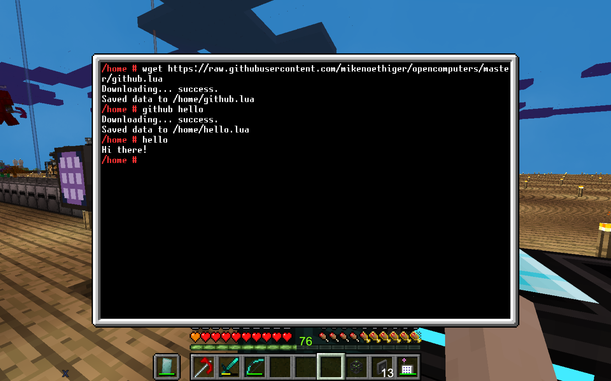

Getting Started
===============

First build a [Basic Computer](https://ocdoc.cil.li/tutorial:oc1_basic_computer). Make sure to put a [network card](https://ocdoc.cil.li/item:network_card) in it, in order to download programs from this repository.

The operating system ships with the [wget](https://linux.die.net/man/1/wget) program with which you can download files via HTTP to your minecraft computer.

I have created the `github.lua` program to simplify downloading programs from this repository even further. So let's start by downloading `github.lu`:

```
wget https://raw.githubusercontent.com/mikenoethiger/opencomputers/master/github.lua
```

From now on you can download any further program from this repository as follows, e.g. to download `hello.lua`:

```
github hello
```



If you want the `github` progam to be available globally, you can move it to `/bin`:

```
mv github.lua /bin
```

Robot
=====

Put a [Computer Case](https://ocdoc.cil.li/block:computer_case) into an [Assembler](https://ocdoc.cil.li/block:assembler) to build a robot. Add other components, depending on the job you want to do. It is important to also add a bootable medium, otherwise the drone won't turn on. You can create a bootable medium, by putting a [Hard Disk](https://ocdoc.cil.li/item:hard_disk_drive) and a [OpenOS Floppy Disk](https://ocdoc.cil.li/item:openos_floppy) into a computer and then run `install`. You'll be asked where to install the OS, pick the identifier of your disk (can be found by hovering over the disk.) Afterwards add this disk to the assembler. It is also advisable to put a tier 1 [Screen](https://ocdoc.cil.li/block:screen) and a [Keyboard](https://ocdoc.cil.li/block:keyboard) into your drone, otherwise you won't be able to edit programs directly on your drone.

oppm
====

`oppm` is a package manager. Craft an `oppm` floppy disk, insert it into the computer, install it with `install oppm`

Links
=====

* [OpenComputers Wiki](https://ocdoc.cil.li/)
* [Lua APIs](https://ocdoc.cil.li/api)
* [Shell API](https://ocdoc.cil.li/api:shell)
